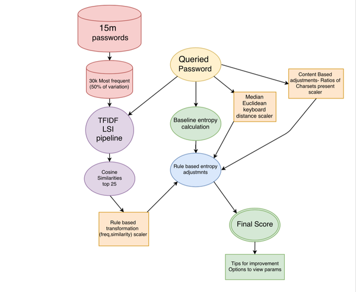

## LSI Powered Password Strength  
### Under Development!  
##### Pardon the dust  

This is a tool for applying Latent Semantic Indexing to quantifying password strength.  It operates on the core assumption that passwords which are used frequently in the population will be inherently easier and faster to crack using existing tools, namely a dictionary attack.  

I'll asterisk this entire thing by saying I've never used a password cracking tool, and I'm by no means an expert security guy.  By extension I am not privey to the 'bleeding edge' of password cracking, so there is a nonzero probability I'm completely out to lunch on the efficacy of this tool.  I am a fraud prevention guy, and so this is built with that in mind.  This is very much a work in  progress and I provide no license or gaurantee of any form explicetly or implied, so make use with all of that in mind.  

With that said, this is what I've come up with so far.  There is a writeup on my [blog](http://kylemix.com/password-strength-detection-with-NLP/) which has a lot more about how the project was started.  Much has changed since that was published, I was working solely in a jupyter notebook at the time, and the current iteration has migrated to a package of tools.  The basic structure of what's going on is shown below.
  
I owe some of the concepts of this work to this great blog post from [simility](https://simility.com/quantifying-insight-data-scientists-translate-hunch-probability-identify-potential-email-fraud/) they produce some of the best fraud prevention software available, and are all awesome, interesting people to boot.  Another source of inspiration is dropbox's fabulous open source tool [zxcvbn](https://github.com/dropbox/python-zxcvbn).  

Standing on those shoulders I came up with the idea of building metrics directly from user passwords in a way that resists reverse engineering, the end goal being to allow a fraud analyst or fraud prevention software to use a password as a feature without exposing the password or user to risk of abuse.  All in the interest of enhancing fraud prevention capabilities while minimizing it's visibility to users or creating undue friction points. Encouraging better choices when it comes to creating strong passwords is a parallel goal. At the end of the day the [xkcd method](https://github.com/mroth/xkcdpass) is king.  Do that.

The original dataset is vast and well worth exploring [Mark Burnett](https://xato.net/today-i-am-releasing-ten-million-passwords-b6278bbe7495#.vrat8u3oo) does a good job explaining it's purpose and his intentions behind it.       

